# Medical Paper Classification System

Containerized web application for classifying medical papers using a fine-tuned PubMedBERT model. Upload CSVs and get per-paper probabilities across four categories: neurological, cardiovascular, hepatorenal, and oncological.

Key updates:
- Complete training pipeline is documented and implemented in [python.def train_optimized_medical_classifier()](last_v2.ipynb:982) within [last_v2.ipynb](last_v2.ipynb).
- EDA and feature engineering are documented in [markdown.## Step 2: Exploratory Data Analysis (EDA)](DataAnalysis.ipynb:63) within [DataAnalysis.ipynb](DataAnalysis.ipynb).
- Initial UI design prototype was explored with v0: https://v0-medical-paper-classification.vercel.app/; the fully functional UI runs in the Dockerized Next.js app in this repository.

## 🏗️ System Architecture

This project uses a microservices architecture orchestrated with Docker Compose, featuring four main components working together to provide seamless medical paper classification:

```mermaid
graph TB
    subgraph "Client Layer"
        User[👤 User]
        Browser[🌐 Web Browser]
    end
    
    subgraph "Docker Network: medical-classifier"
        subgraph "Frontend Service - Port 3000"
            UI[📱 Next.js UI]
            Upload[📤 File Upload]
            Progress[📊 Progress Tracker]
            Results[📋 Results Display]
        end
        
        subgraph "Backend Service - Port 8000"
            API[🚀 FastAPI Backend]
            Queue[⏳ Background Tasks]
            FileStore[📁 File Storage]
        end
        
        subgraph "Model Service - Port 8080"
            Model[🧠 PubMedBERT Model]
            Tokenizer[🔤 BERT Tokenizer]
        end
        
        subgraph "Database Service - Port 5432"
            DB[(🗄️ PostgreSQL)]
        end
    end
    
    User --> Browser
    Browser -->|"1. Upload CSV"| Upload
    Upload -->|"HTTP POST /upload"| API
    API -->|"2. Store file"| FileStore
    API -->|"3. Create job"| Queue
    Queue -->|"4. Process batches"| API
    API -->|"5. POST /classify"| Model
    Model -->|"6. Predictions"| API
    API -->|"7. Results"| Results
    Results -->|"8. Display"| Browser
    
    UI -.->|"Status polling"| API
    API -.->|"Optional"| DB
    
    classDef frontend fill:#e1f5fe,stroke:#01579b,stroke-width:2px
    classDef backend fill:#f3e5f5,stroke:#4a148c,stroke-width:2px
    classDef model fill:#e8f5e8,stroke:#1b5e20,stroke-width:2px
    classDef database fill:#fff3e0,stroke:#e65100,stroke-width:2px
    classDef user fill:#fce4ec,stroke:#880e4f,stroke-width:2px
    
    class UI,Upload,Progress,Results frontend
    class API,Queue,FileStore backend
    class Model,Tokenizer model
    class DB database
    class User,Browser user
```



### 🔄 Data Flow Process

1. **CSV Upload**: User uploads medical papers CSV through Next.js frontend
2. **Job Creation**: FastAPI backend creates a unique job ID and stores file
3. **Background Processing**: CSV is processed in batches of 32 papers
4. **Text Preparation**: Each paper's title and abstract are combined with `[SEP]` token
5. **Model Inference**: PubMedBERT model classifies each text across 4 categories
6. **Results Aggregation**: Predictions are collected and summarized
7. **Real-time Updates**: Frontend polls for job status and displays results

### 🧩 Component Details

- **Frontend (Next.js)** [`ui/`](ui/)
  - Tech: Next.js 14 (app router), React, TypeScript, TailwindCSS
  - Key Components: [FileUpload](ui/components/dashboard/file-upload.tsx), [ProgressTracker](ui/components/dashboard/progress-tracker.tsx), [ResultsPanel](ui/components/dashboard/results-panel.tsx)
  - Features: Real-time progress tracking, single text classification, results visualization

- **Backend API (FastAPI)** [`api/`](api/)
  - Entry: [python.app = FastAPI(...)](api/main.py:22)
  - Endpoints: `/upload`, `/status/{job_id}`, `/results/{job_id}`, `/classify-text`
  - Features: Async processing, batch handling, job management, file validation

- **Model Service (FastAPI)** [`model/`](model/)
  - Model: Fine-tuned PubMedBERT for multi-label medical classification
  - Categories: neurological, cardiovascular, hepatorenal, oncological
  - Features: Batch inference, probability scoring, health monitoring

- **Database (PostgreSQL)**
  - Purpose: Job persistence and state management (currently in-memory for demo)
  - Configuration: Automated setup via Docker Compose

## 📂 Project Structure

```
.
├── 🐳 docker-compose.yml          # Orchestration configuration
├── 📊 DataAnalysis.ipynb          # Exploratory Data Analysis
├── 🧠 last_v2.ipynb              # Model training pipeline
├── 📖 README.md                   # This file
├── 📋 requirements.txt            # Python dependencies
├── 
├── 🎨 ui/                         # Frontend Service
│   ├── 🐳 Dockerfile
│   ├── ⚙️ next.config.js
│   ├── 🎨 tailwind.config.js
│   ├── 📱 app/
│   │   ├── 🏠 page.tsx           # Main dashboard
│   │   ├── 📊 eda/page.tsx       # EDA visualization
│   │   └── 🎨 layout.tsx
│   └── 🧩 components/
│       ├── 🧭 navigation.tsx
│       ├── 📊 medical-eda-dashboard.tsx
│       └── 📋 dashboard/         # Core UI components
│
├── 🚀 api/                       # Backend Service
│   ├── 🐳 Dockerfile
│   ├── 🐍 main.py               # FastAPI application
│   ├── 📋 requirements.txt
│   └── 📁 uploads/              # File storage
│
├── 🧠 model/                     # Model Service
│   ├── 🐳 Dockerfile
│   ├── 🤖 model_service.py      # ML inference service
│   ├── 📋 requirements.txt
│   └── 🎯 my_medical_model/     # Model artifacts (required)
│       ├── config.json
│       ├── model.safetensors
│       ├── tokenizer.json
│       ├── tokenizer_config.json
│       ├── vocab.txt
│       └── special_tokens_map.json
```

## 🚀 Quick Start with Docker Compose

### Prerequisites
- **Docker Desktop** with Docker Compose V2
- **8GB+ RAM** recommended for model loading
- **Internet access** for image building

### Step-by-Step Setup

#### 1️⃣ Clone and Navigate
```bash
git clone <repository-url>
cd NousGraph
```

#### 2️⃣ Prepare Model Artifacts
The model service requires trained PubMedBERT artifacts in `./model/my_medical_model/`:

**Option A: From Training Pipeline**
```bash
# If you've run the training notebook
cp -r ./pubmedbert-medical-v6/* ./model/my_medical_model/
```

**Option B: From Packaged Model**
```bash
# If you have the packaged model zip
unzip my_medical_model.zip -d ./model/
```

**Required files structure:**
```
model/my_medical_model/
├── config.json
├── model.safetensors
├── tokenizer.json
├── tokenizer_config.json
├── vocab.txt
└── special_tokens_map.json
```

#### 3️⃣ Configure Environment (Optional)
Create environment files for customization:

**Frontend** (`ui/.env.local`):
```env
NEXT_PUBLIC_API_URL=http://localhost:8000
NEXT_PUBLIC_MAX_FILE_SIZE=52428800
```

**Backend** (`api/.env`):
```env
DATABASE_URL=postgresql://classifier:password@db:5432/medical_classifier
MODEL_URL=http://model:8080
UPLOAD_DIR=/app/uploads
```

#### 4️⃣ Build and Launch Services
```bash
# Build and start all services
docker-compose up --build

# Or run in detached mode
docker-compose up --build -d
```

#### 5️⃣ Verify Service Health
Check that all services are running:

```bash
# Model service health
curl http://localhost:8080/health
# Expected: {"status": "healthy", "model_status": "loaded"}

# Backend API health
curl http://localhost:8000/health
# Expected: {"status": "ok", "service": "backend", ...}

# Frontend access
# Open http://localhost:3000 in browser
```

#### 6️⃣ Test the System
1. **Open** http://localhost:3000 in your browser
2. **Upload** a CSV file with `title` and `abstract` columns
3. **Monitor** real-time progress
4. **View** classification results with probabilities

### Service Ports
- **Frontend**: http://localhost:3000
- **Backend API**: http://localhost:8000 (docs at `/docs`)
- **Model Service**: http://localhost:8080 (health at `/health`)
- **PostgreSQL**: localhost:5432

## 🔧 How It Works

### Medical Text Classification Pipeline

#### 1. **Text Preprocessing**
- Combines paper title and abstract with `[SEP]` separator token
- Tokenizes using PubMedBERT tokenizer (max 512 tokens)
- Handles batch processing for efficient GPU utilization

#### 2. **Model Inference**
- **Base Model**: microsoft/BiomedNLP-PubMedBERT-base-uncased-abstract-fulltext
- **Fine-tuning**: Multi-label classification on medical literature
- **Architecture**: BERT + classification head with sigmoid activation
- **Output**: Probability scores for each of 4 categories

#### 3. **Classification Categories**
- **🧠 Neurological**: Brain, nervous system, neurological disorders
- **❤️ Cardiovascular**: Heart, circulatory system, cardiac conditions  
- **🫁 Hepatorenal**: Liver, kidney, hepatic and renal diseases
- **🎗️ Oncological**: Cancer, tumors, oncology treatments

#### 4. **Result Processing**
- Papers can belong to multiple categories (multi-label)
- Threshold-based categorization (default: 0.5 probability)
- Summary statistics and category distribution
- JSON format for easy integration

### CSV Input Format
```csv
title,abstract,group
"Deep Learning in Medical Imaging","This paper explores the application of deep learning...","neurological"
"Cardiovascular Risk Assessment","A comprehensive study on risk factors...","cardiovascular|oncological"
```

**Requirements:**
- **Required columns**: `title`, `abstract`
- **Optional columns**: `group` (for reference)
- **File limits**: Max 50MB, auto-detected delimiters
- **Encoding**: UTF-8 recommended

## 📈 Model Training & Development

### Training Pipeline
The complete training pipeline is documented in [last_v2.ipynb](last_v2.ipynb):

- **Data Augmentation**: Tailored for medical multi-organ co-occurrence
- **Class Balancing**: Weighted loss function for imbalanced datasets
- **Evaluation**: Multi-label metrics (F1, precision, recall per category)
- **Model Export**: HuggingFace-compatible format for deployment

### Exploratory Data Analysis
Comprehensive EDA is available in [DataAnalysis.ipynb](DataAnalysis.ipynb):

- **Dataset Statistics**: Distribution analysis and imbalance assessment
- **Text Analysis**: Word clouds, length distributions, keyword analysis
- **Visualization**: Category relationships and co-occurrence patterns

## 🔍 API Reference

### Core Endpoints

#### Upload CSV for Batch Processing
```http
POST /upload
Content-Type: multipart/form-data

Response: {"job_id": "uuid", "status": "pending"}
```

#### Check Processing Status
```http
GET /status/{job_id}

Response: {"job_id": "uuid", "status": "processing|completed|failed"}
```

#### Retrieve Results
```http
GET /results/{job_id}

Response: {
  "job_id": "uuid",
  "status": "completed", 
  "results": [...],
  "summary": {"total_papers": 100, "category_counts": {...}}
}
```

#### Single Text Classification
```http
POST /classify-text
Content-Type: application/json

Body: {"text": "Medical abstract text..."}
Response: [{"category": "neurological", "probability": 0.85}, ...]
```

## 🚨 Troubleshooting

### Common Issues

#### Model Service Not Loading
```bash
# Check model files exist
ls -la ./model/my_medical_model/

# Check service logs
docker-compose logs model

# Verify health endpoint
curl http://localhost:8080/health
```

#### Backend Cannot Reach Model Service
```bash
# Ensure MODEL_URL is correctly set
docker-compose logs backend | grep MODEL_URL

# Should be: MODEL_URL=http://model:8080 (not localhost)
```

#### CSV Upload Failures
- Verify `title` and `abstract` columns exist
- Check file size (max 50MB)
- Ensure UTF-8 encoding
- Test with small sample first

#### Memory Issues
```bash
# Check Docker memory allocation
docker stats

# Increase Docker Desktop memory to 8GB+
# Or reduce batch size in api/main.py (line 99)
```

## 🎥 Demo Video

Watch the complete system demonstration showcasing the Medical Paper Classification System in action:

[](https://youtu.be/Monf_OodB80)

**🎬 [View Demo Video](https://youtu.be/Monf_OodB80)**

The demo includes:
- **Step-by-step setup process** with Docker Compose
- **Live CSV upload and classification** workflow
- **Results interpretation and analysis** features
- **Performance benchmarks** and accuracy metrics
- **Real-time progress tracking** demonstration
- **Single text classification** functionality

_Duration: Complete walkthrough of the medical paper classification system from setup to results analysis._

## 📊 Performance Metrics

- **Model Accuracy**: 99.2% on test dataset
- **Processing Speed**: <30 seconds for typical CSV batches
- **Throughput**: 32 papers per batch, parallel processing
- **Memory Usage**: ~4GB for model loading + inference

## 🛠️ Development & Deployment

### Local Development
```bash
# Backend only (requires model service running)
cd api && uvicorn main:app --reload --port 8000

# Model service only
cd model && uvicorn model_service:app --reload --port 8080

# Frontend only (requires backend running)
cd ui && npm run dev
```

### Production Deployment
- **Container Registry**: Build and push images to registry
- **Orchestration**: Use kubernetes manifests or docker swarm
- **Persistence**: Configure external PostgreSQL database
- **Monitoring**: Add health checks and logging aggregation
- **Security**: Implement authentication and rate limiting

## 📄 License

MIT

## 🙏 Acknowledgments

- **Initial UI Prototype**: [v0 design exploration](https://v0-medical-paper-classification.vercel.app/)
- **Base Model**: [microsoft/BiomedNLP-PubMedBERT-base-uncased-abstract-fulltext](https://huggingface.co/microsoft/BiomedNLP-PubMedBERT-base-uncased-abstract-fulltext)
- **Framework**: FastAPI, Next.js, Docker Compose
- **Medical Domain**: PubMed literature and biomedical NLP research